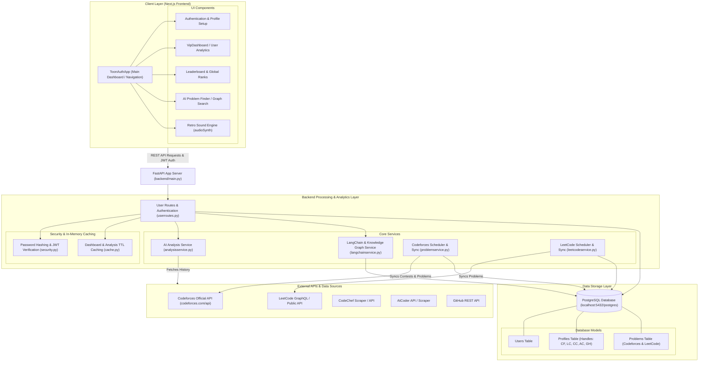

# CP Profiles - Competitive Programming Analytics & Hub

A comprehensive full-stack competitive programming aggregation and analytics platform. **CP Profiles** aggregates profiles, ratings, problem-solving history, heatmaps, AI-driven strength/weakness analysis, and AI problem recommendations across major competitive programming platforms like **LeetCode**, **Codeforces**, **CodeChef**, **AtCoder**, and **GitHub**.

---

## System Architecture & Workflow Diagram



---

## Tech Stack

### Frontend
- **Framework**: Next.js (App Router, React)
- **Styling**: Tailwind CSS / Vanilla CSS with custom animations & Cyberpunk/Neumorphic UI elements
- **Audio & Interactivity**: Custom Web Audio API Synthesizer (`audioSynth.js`)

### Backend
- **Framework**: Python FastAPI
- **Database & ORM**: PostgreSQL & SQLAlchemy
- **Schedulers & Async**: APScheduler & Python Asyncio
- **AI & Analytics**: LangChain, Custom Vector/Graph indexing algorithms for problem recommendations
- **Authentication**: OAuth2 / Passlib (Bcrypt) & PyJWT

---

## Getting Started

### Prerequisites
- Node.js (v18+) & `npm`
- Python (v3.10+)

### 1. Backend Setup

```bash
# Navigate to the backend directory
cd backend

# Create and activate a virtual environment
python -m venv env
# On Windows:
env\Scripts\activate
# On Linux/macOS:
source env/bin/activate

# Install dependencies
pip install -r requirements.txt

# Run the FastAPI server
uvicorn main:app --reload --port 8000
```

The backend server will start at `http://localhost:8000`.

### 2. Frontend Setup

```bash
# Navigate to the frontend directory
cd frontend

# Install npm packages
npm install

# Run the Next.js development server
npm run dev
```

Open [http://localhost:3000](http://localhost:3000) with your browser to view the application.

---

## Key Features

1. **Multi-Platform Profile Aggregation**: Connect and track performance across Codeforces, LeetCode, CodeChef, AtCoder, and GitHub.
2. **AI-Powered Analytics**: Receive personalized insights into strengths, weaknesses, and recommended problem tags.
3. **Problem Knowledge Graph**: Dynamic problem discovery and search built with LangChain and vector graph representations.
4. **Automated Background Schedulers**: Auto-synchronize problem sets and rating metrics periodically.
5. **Interactive UI & Gamified Soundscape**: Modern cyberpunk design paired with custom Web Audio feedback for an immersive user experience.

